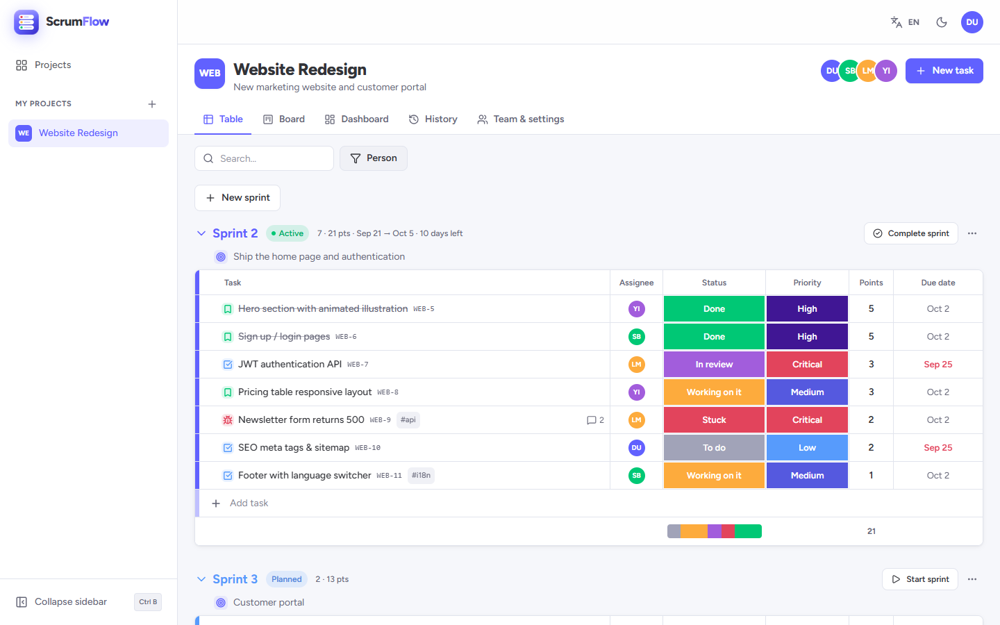
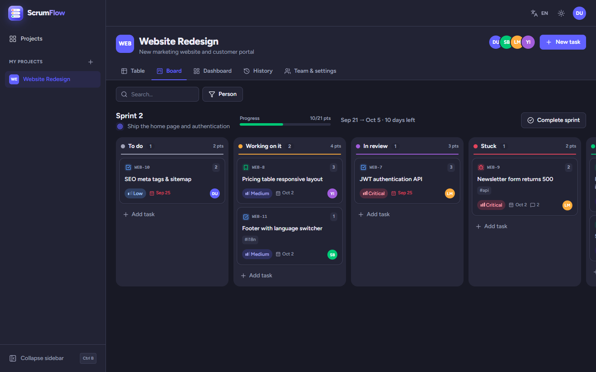
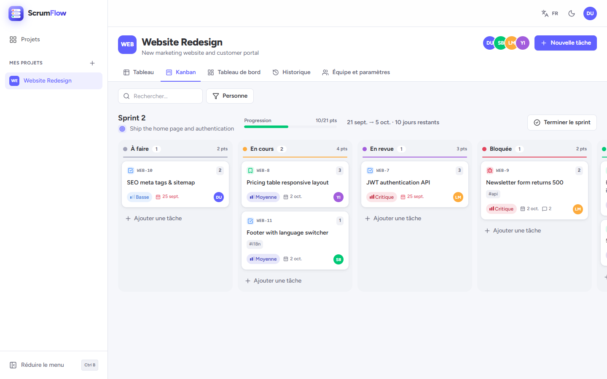
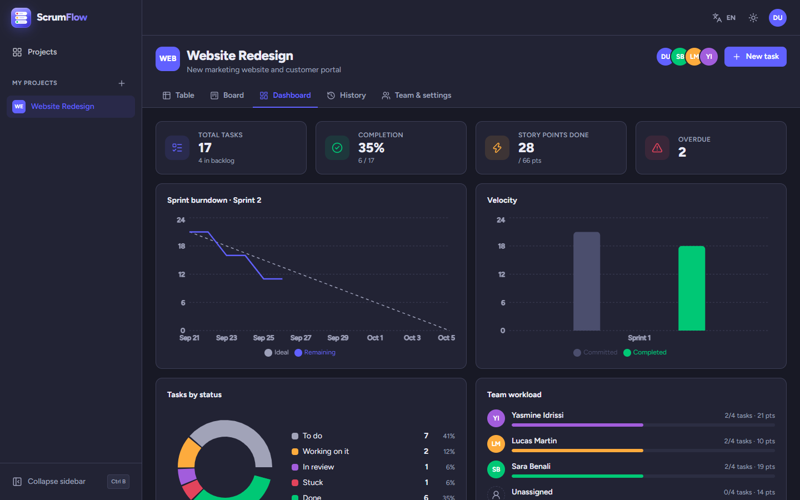
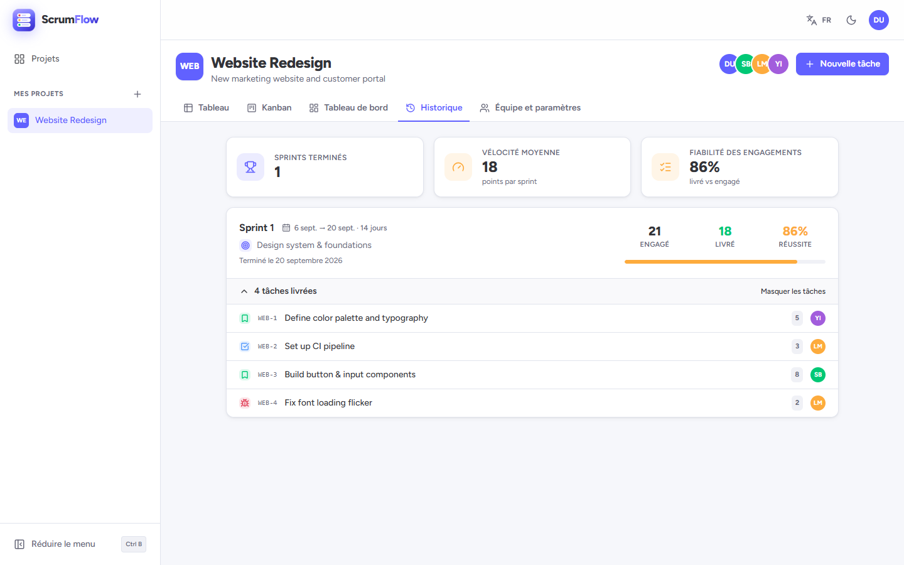
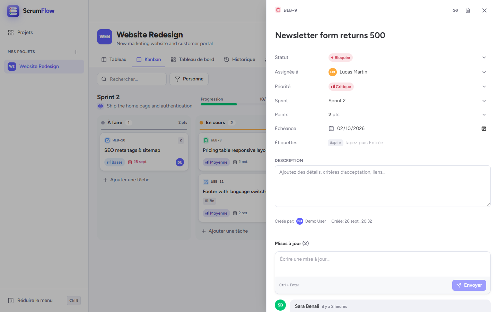
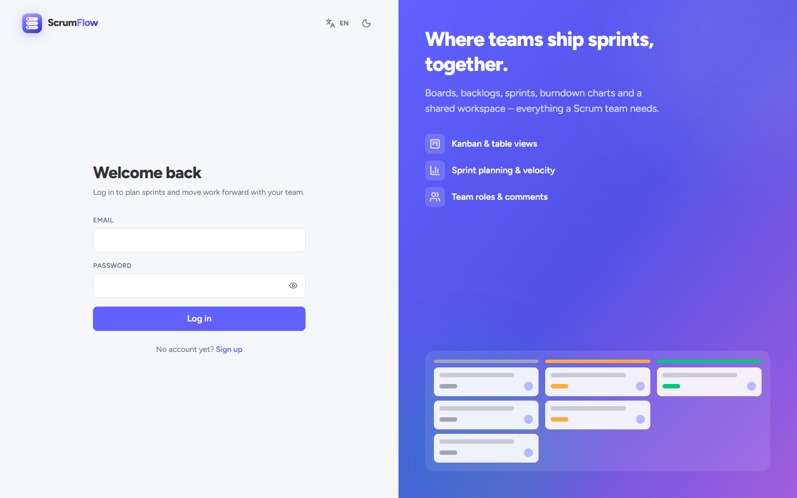
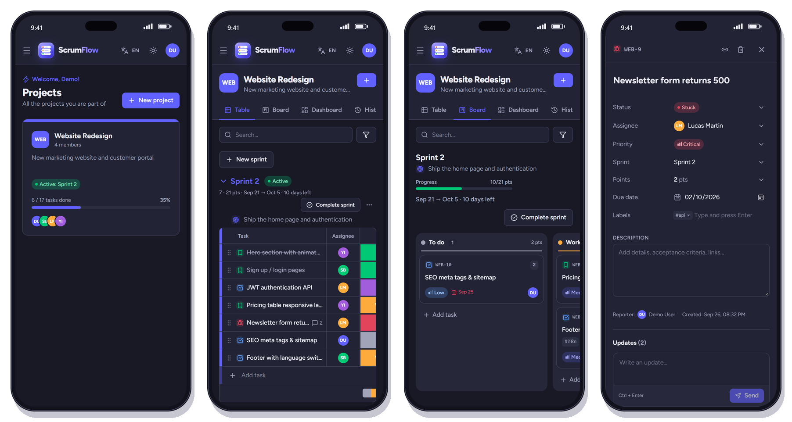

# ScrumFlow

[](https://github.com/ACHRAF-BADRI/React-To-Do-List/actions/workflows/ci.yml)

ScrumFlow is a workspace for Scrum teams. Plan your sprints, organize the backlog, move tasks across a board, follow progress with burndown and velocity charts, and discuss work directly on each task. It works in **English and French**, in **light and dark** mode, on desktop and mobile.

### 🔗 Live app: [scrumflow.pages.dev](https://scrumflow.pages.dev/register)

Create your free account, then start a project and invite your team.

> The API runs on Render's free plan and sleeps when idle, so the first request can take up to a minute.



| Board (dark mode) | Board (in French) |
| --- | --- |
|  |  |

| Dashboard | Sprint history |
| --- | --- |
|  |  |

| Task details | Sign in |
| --- | --- |
|  |  |

### On phones

The whole app is responsive. Here it is on a phone (390 px wide, dark mode):



<p align="center"><sub>Projects list · Table view · Board · Task details</sub></p>

## How it works

A **project** holds your team, your backlog and your sprints. Every task has a type (story, task, bug, epic), a status, a priority, story points, an assignee, a due date and labels.

1. **Build the backlog**: add tasks to the backlog as ideas and requests come in.
2. **Plan a sprint**: create a sprint and drag tasks from the backlog into it.
3. **Start the sprint**: set its goal and dates. It becomes the *active* sprint and appears on the board.
4. **Work on the board**: move tasks from *To do* to *Working on it*, *In review* and *Done*. Mark blocked work as *Stuck*.
5. **Complete the sprint**: unfinished tasks move to the next sprint or back to the backlog. The results (committed vs delivered points) are saved and the sprint moves to the **History** tab.

## Features

- **Projects & team**: invite teammates by email, with roles (owner / admin / member) checked by the API. People without an account receive an invitation link, sign up and land directly in the project.
- **Table view**: tasks grouped by sprint and backlog. Status, priority, assignee, points and due date are edited directly in the row. Each group shows a status bar and its total points. Drag tasks between groups to plan sprints.
- **Board**: the active sprint by status, with drag & drop, quick add, sprint goal, progress and days left. **WIP limits** per column turn it red when too many tasks are in progress.
- **Daily standup**: for each person, what they finished since the last working day, what they are working on and what blocks them, with a timed walkthrough (1 to 3 minutes each, shuffle, next speaker)
- **Planning poker**: pick a task, everyone on the page votes in secret in real time, reveal the cards, see the average and save the estimate on the task
- **Blocked by**: link tasks that must be finished first; a lock shows on cards and rows until the blockers are done (loops are refused)
- **Custom workflow**: each project chooses its own statuses (name, color, order) and which ones count as done, in Team & settings
- **Calendar**: tasks on a month grid by due date; drag a task to another day (or from "No due date") to reschedule it; the active sprint is highlighted
- **Epics**: link stories to an epic, see its progress in the task panel and on the dashboard, filter the board by epic
- **Retrospective** for each sprint: what went well, what to improve, actions; votes, and actions turned into backlog tasks
- **Command palette** (`Ctrl/⌘ + K`): search any task (by title or key such as `WEB-12`) or project, and run quick actions
- **Sprints**: create, start (goal and dates), complete (choose where open tasks go). Completed sprints can't be deleted, so the team's velocity history stays accurate.
- **Activity log**: every change in the project (status, assignee, points, checklist, sprints, members…) as a timeline grouped by day, filterable by person, updated live
- **My work**: all the tasks assigned to you in every project, grouped by due date (overdue, today, this week, later), with a project filter and inline status change
- **History**: every completed sprint with its dates, goal, committed and delivered points, completion rate and delivered tasks, plus the team's average velocity and commitment reliability
- **Task details**: a side panel with its own shareable link (`?task=…`), a **Markdown** description (toolbar, preview, pasted images), labels, a **checklist** of subtasks (progress shown on table rows and board cards), **attachments**, commits and pull requests from GitHub, comments with **@mentions** and Markdown, and the task's **history**
- **Attachments**: drop files on a task (10 MB each, stored on Cloudinary, uploaded straight from the browser with a signature from the API); images show as thumbnails
- **Templates and recurring tasks**: save any task as a template (with its checklist), start new tasks from it, or make it repeat every day, week or month in the active sprint or the backlog
- **Dashboard**: key numbers, sprint **burndown** and **burnup** (any started sprint), **cumulative flow**, velocity, tasks by status and team workload
- **Exports**: all tasks or the filtered ones as CSV (Excel and Google Sheets ready), and a printable **sprint report** to save as PDF
- **Public link**: share a read-only board of the active sprint with people who have no account (no emails, comments or files shown), turn it off or replace it anytime
- **Search & filters**: by keyword, task key, person, epic, priority, type or label, and **saved views** to reuse a set of filters
- **Interface**: colored status badges, toasts, themed tooltips, illustrated empty states, confirmation dialogs, collapsible sidebar (`Ctrl/⌘ + B`) and a mobile menu
- **Languages**: English / French (i18next), saved on the user profile, dates formatted for each language
- **Themes**: light / dark / system, saved on the profile, no flash on load
- **Emails** (Resend): invitations, forgot password (1 hour link), and notifications when a task is assigned to you or someone mentions you. Each user can turn notifications off in Account settings.
- **Account**: profile, password, email notifications, favorite projects, and account deletion confirmed by typing your name
- **Sign in with Google, Microsoft, GitHub, GitLab or Bitbucket** (same verified email = same account; gitlab.com or a self-hosted GitLab) and **two-step verification** with an authenticator app, with one-time recovery codes
- **Git integration (GitHub or GitLab)**: connect a repository with a webhook; commits and pull or merge requests that mention a task key (`APO-12`) appear on the task, and merging can move it to done
- **AI suggestions** (optional, free with Groq or Gemini): suggest checklist steps and acceptance criteria for a story, suggest story points from similar finished tasks, and draft a sprint review with retrospective cards. Suggestions are only a preview until you add them, with a daily limit per project
- **Installable app (PWA)**: install ScrumFlow on a phone or desktop; pages already opened stay readable offline
- **Real time** (Socket.io): teammates' changes appear instantly without reloading, and the project header shows who is viewing it right now
- **Notification bell**: assignments, @mentions and "added to a project" arrive live with a toast; open one to jump to the task, or mark all as read

## Logo

The logo is a stack of three task cards, each with its status dot: red (stuck), orange (working on it) and green (done), the same colors as the app's statuses. It lives in `client/src/components/ui/LogoMark.jsx` (in-app) and `client/public/favicon.svg` (browser tab); keep both in sync.

## Tech stack

| Layer | Tech | Hosting |
| --- | --- | --- |
| Front end | React 18, Vite, Tailwind CSS, React Router, dnd-kit, Recharts, i18next, sonner, lucide, Socket.io client, marked + DOMPurify, qrcode, service worker | **Cloudflare Pages** |
| API | Node.js, Express 5, Mongoose, JWT, bcrypt, helmet, rate limiting, Socket.io, Resend, TOTP, OAuth 2 (Google, Microsoft, GitHub, GitLab, Bitbucket), GitHub and GitLab webhooks | **Render** |
| Files | Cloudinary (optional) | **Cloudinary** |
| Database | MongoDB | **MongoDB Atlas** |

```
├── client/          React app (Cloudflare Pages)
│   └── src/
│       ├── components/   ui/ (badges, modal, popover, tooltip, toaster, illustrations, logo…),
│       │                 tasks/, sprints/, layout/
│       ├── context/      Auth, Theme, Projects, Project (data + optimistic mutations)
│       ├── hooks/        useContainerDnd (shared drag & drop logic)
│       ├── i18n/         en.js, fr.js
│       └── pages/        Auth, Projects, My work, Account, Sprint report, Shared board, Project + views/ (Table, Board, Calendar, Standup, Poker, Dashboard, Activity, History, Retrospective, Team)
├── server/          Express API (Render)
│   └── src/
│       ├── models/       User, Project, Sprint, Task, Invitation, Notification, Activity
│       ├── routes/       auth, oauth, projects (+members, stats, flow, share, git), sprints, tasks, templates, public, webhooks (GitHub, GitLab)
│       ├── services/     activity, notify, poker, recurring, cloudinary, oauth, migrations, ai
│       └── seed.js       sample data for local development
└── render.yaml
```

## Run locally

Requirements: Node 18+ and a MongoDB database (a free Atlas cluster or a local `mongod`).

```bash
npm run install:all

# server/.env  (copy from server/.env.example)
MONGODB_URI=mongodb+srv://...     # or mongodb://127.0.0.1:27017/scrumflow
JWT_SECRET=some-long-random-string
CLIENT_URL=http://localhost:5173

# client/.env  (copy from client/.env.example)
VITE_API_URL=http://localhost:5000

npm run seed          # optional, local database only: sample team and project (never run it on production)
npm run dev:server    # http://localhost:5000
npm run dev:client    # http://localhost:5173 (in a second terminal)
```

## Tests

```bash
npm --prefix server test   # API: node:test + Supertest on an in-memory MongoDB (no Atlas needed)
npm --prefix client test   # Front end: Vitest + Testing Library
```

GitHub Actions runs both suites and the production build on every push to `main` and on every pull request (`.github/workflows/ci.yml`).

## Deploy

### 1. MongoDB Atlas
1. Create a free **M0** cluster.
2. **Database Access**: add a database user.
3. **Network Access**: allow `0.0.0.0/0` (Render's free tier has no fixed IP).
4. **Connect → Drivers**: copy the connection string and add the database name, e.g. `…mongodb.net/scrumflow?retryWrites=true&w=majority`.

### 2. Render (API)
1. Render dashboard → **New → Blueprint** → select this repo (it reads `render.yaml`).
2. Fill in `MONGODB_URI` (Atlas string), `CLIENT_URL` (your front-end URL, which you can set after step 3) and `RESEND_API_KEY` (for emails, optional). `JWT_SECRET` is generated for you, and `EMAIL_FROM` defaults to `onboarding@resend.dev` until you verify a domain in Resend.
3. Check `https://<your-service>.onrender.com/api/health` → `{"status":"ok","db":"connected"}`.

> **Emails:** until a domain is verified in Resend (Domains → Add domain, then add the DNS records it shows), Resend only delivers to the email of your Resend account. The app still shows the invitation link so it can be shared by hand. Once the domain is verified, set `EMAIL_FROM` to an address on it, e.g. `ScrumFlow <noreply@yourdomain.com>`.

> Free Render services sleep after inactivity. The first request can take ~50s, and the app shows a "waking up the server" toast while it waits.

### Optional features

Each one stays hidden in the app until its keys are set on Render (and in `server/.env` locally).

| Feature | Environment variables | Where to get them |
| --- | --- | --- |
| Attachments | `CLOUDINARY_URL` | Cloudinary dashboard, "API environment variable" (`cloudinary://<key>:<secret>@<cloud>`) |
| Sign in with Google | `GOOGLE_CLIENT_ID`, `GOOGLE_CLIENT_SECRET` | Google Cloud console, Credentials, OAuth client ID (web). Redirect URI: `https://<your-service>.onrender.com/api/auth/oauth/google/callback` |
| Sign in with Microsoft | `MICROSOFT_CLIENT_ID`, `MICROSOFT_CLIENT_SECRET` | Microsoft Entra admin center, App registrations (accounts in any organizational directory and personal accounts). Redirect URI (Web): `https://<your-service>.onrender.com/api/auth/oauth/microsoft/callback`. Add the optional ID token claims `email` and `xms_edov` so work accounts can sign in |
| Sign in with GitLab | `GITLAB_CLIENT_ID`, `GITLAB_CLIENT_SECRET`, optional `GITLAB_URL` (self-hosted, default `https://gitlab.com`) | GitLab, Preferences (or Edit profile), Applications, Add new application, scope `read_user`. Redirect URI: `https://<your-service>.onrender.com/api/auth/oauth/gitlab/callback` |
| AI suggestions | `AI_PROVIDER` (`groq`, `gemini`, `openrouter` or `anthropic`) and its key: `GROQ_API_KEY`, `GEMINI_API_KEY`, `OPENROUTER_API_KEY` or `ANTHROPIC_API_KEY`. Optional: `AI_MODEL`, `AI_DAILY_LIMIT` (per project, default 30) | Groq: console.groq.com, API Keys (free tier). Gemini: aistudio.google.com, Get API key (free tier). Default models: Groq `openai/gpt-oss-120b`, Gemini `gemini-2.5-flash`; set `AI_MODEL` if a provider retires one |
| Sign in with Bitbucket | `BITBUCKET_CLIENT_ID`, `BITBUCKET_CLIENT_SECRET` | Bitbucket, workspace settings, OAuth clients, Create OAuth client. Callback URL: `https://<your-service>.onrender.com/api/auth/oauth/bitbucket/callback`, permissions Account: Email and Read (one callback URL per client: create a second client for localhost) |
| Sign in with GitHub | `GITHUB_CLIENT_ID`, `GITHUB_CLIENT_SECRET` | GitHub, Settings, Developer settings, OAuth Apps. Callback URL: `https://<your-service>.onrender.com/api/auth/oauth/github/callback` |

Render sets `RENDER_EXTERNAL_URL` itself, which the API uses to build these URLs; elsewhere set `API_URL`. The Git integration needs no key: a project admin picks GitHub or GitLab in Team & settings and pastes the webhook URL and secret in the repository settings. Two-step verification, planning poker, exports, the public link and the installable app work without any setup.

### 3. Cloudflare Pages (front end)
1. Cloudflare dashboard → **Workers & Pages → Create → Pages → Connect to Git** → select this repo.
2. Build settings: framework preset **Vite**, root directory **`client`**, build command **`npm run build`**, output directory **`dist`**.
3. **Environment variables**: `VITE_API_URL=https://<your-service>.onrender.com`.
4. Deploy, then put the Pages URL (e.g. `https://<project>.pages.dev`) first in `CLIENT_URL` on Render. Several origins can be comma-separated; preview deployments of that project (`https://<preview>.<project>.pages.dev`) are allowed automatically.

`client/public/_redirects` sends every route to the app and `client/public/_headers` keeps the service worker fresh.

## API overview

All routes are under `/api`, and everything except auth needs `Authorization: Bearer <token>`.

| Method | Route | Description |
| --- | --- | --- |
| POST | `/auth/register`, `/auth/login` | Get a JWT |
| GET/PATCH | `/auth/me` | Profile, language, theme |
| GET/POST | `/projects` | List (with stats) / create |
| GET/PATCH/DELETE | `/projects/:id` | Read / update, including the `statuses` workflow (admin) / delete (owner) |
| POST/PATCH/DELETE | `/projects/:id/members[/:userId]` | Invite, change role, remove / leave |
| GET | `/projects/:id/stats` | Totals, burndown, velocity, workload |
| GET/POST | `/projects/:id/sprints` | List / create |
| PATCH/DELETE | `/projects/:id/sprints/:sprintId` | Edit / delete a planned sprint (its tasks go back to the backlog; completed sprints are kept) |
| POST | `/projects/:id/sprints/:sprintId/start` \| `/complete` | Sprint lifecycle |
| GET/POST | `/projects/:id/tasks` | List (`?sprint=<id>\|backlog`) / create |
| GET/PATCH/DELETE | `/projects/:id/tasks/:taskId` | Task CRUD |
| POST | `/projects/:id/tasks/reorder` | Bulk order/status after drag & drop |
| POST/DELETE | `/projects/:id/tasks/:taskId/comments[/:commentId]` | Comments (`@Full Name` emails that member) |
| POST/PATCH/DELETE | `/projects/:id/tasks/:taskId/checklist[/:itemId]` | Checklist items (add, rename, check, delete) |
| GET | `/projects/:id/activity` · `/projects/:id/tasks/:taskId/activity` | Activity log (`?before=` for older, `?actor=`) / one task's history |
| GET | `/me/tasks` | My work (`?status=done` for the last 14 days) |
| GET | `/me/search?q=` | Command palette: tasks by title or key, projects |
| GET/POST/PATCH/DELETE | `/projects/:id/sprints/:sprintId/retro[/:itemId]` | Retrospective cards · `POST …/:itemId/vote` · `POST …/:itemId/task` |
| GET/DELETE | `/projects/:id/invitations[/:invitationId]` | Pending invitations (admin) |
| GET · POST | `/invitations/:token` · `/invitations/:token/accept` | Public invitation details / accept |
| POST | `/auth/forgot-password` · `/auth/reset-password` | Email a reset link / choose a new password |
| GET · POST · PATCH | `/notifications` · `/notifications/read-all` · `/notifications/:id/read` | Bell: latest notifications / mark as read |
| PATCH · POST · DELETE | `/auth/me` · `/auth/me/password` · `/auth/me` | Profile / change password / delete account |
| POST | `/auth/2fa` · `/auth/me/2fa/setup` · `/auth/me/2fa/enable` · `/auth/me/2fa/disable` | Two-step verification (login code, set up, turn on or off) |
| GET | `/auth/oauth/:provider` · `/auth/oauth/:provider/callback` | Sign in with Google, Microsoft, GitHub, GitLab or Bitbucket |
| GET | `/config` | Optional features turned on (attachments, sign in providers) |
| GET | `/projects/:id/stats?sprint=` · `/projects/:id/flow` | Burndown and burnup of a sprint · cumulative flow |
| GET/POST/PATCH/DELETE | `/projects/:id/templates[/:templateId]` | Task templates and their repeat rule |
| POST · DELETE | `/projects/:id/tasks/:taskId/attachments/sign` · `/attachments[/:attachmentId]` | Upload signature, save or delete a file |
| GET/POST/DELETE | `/projects/:id/share` · GET `/public/:token` | Public read-only link (admin) · the shared board, no account |
| GET/POST/PATCH/DELETE | `/projects/:id/git` · POST `/webhooks/github/:projectId` · `/webhooks/gitlab/:projectId` | Git integration settings (admin, `{ provider: 'github' \| 'gitlab' }`) · webhooks from GitHub (signed) and GitLab (secret token) |
| GET/POST/DELETE | `/me/filters[/:filterId]` | Saved views (per project) |
| POST | `/projects/:id/ai/tasks/:taskId/breakdown` · `/estimate` · `/projects/:id/ai/sprints/:sprintId/summary` | AI suggestions (never saved by themselves) |

Realtime events (Socket.io, same JWT in the handshake): `project:changed`, `presence`, `notification`, `projects:changed`, and `poker:state` for planning poker (`poker:start`, `poker:vote`, `poker:reveal`, `poker:restart`, `poker:end` from the client). The socket only says *when* to refresh; data always comes from the REST API.

Errors return `{ message, code }`, where `code` is an i18n key (e.g. `errors.sprintAlreadyActive`) that the client translates.

## Reusing this for other team apps

The same structure works for other work-management tools (bug tracker, content calendar, sales pipeline…):

- **Workspace → Project → Iteration → Item.** Rename `Sprint`/`Task` and keep the membership check (`requireProject(roles)`) that protects every nested route.
- **The workflow is data, not code.** Each project stores its statuses (key, name, color, category) and the "done" category drives completion, burndown and velocity (`server/src/utils/statuses.js`, `client/src/hooks/useStatuses.js`). Priorities and types live in `client/src/lib/constants.js`.
- **One drag & drop hook for everything.** `useContainerDnd` moves items between any containers (statuses, sprints, owners…) and returns the new order to save.
- **Optimistic updates in one context.** `ProjectContext` updates the UI first, calls the API, and rolls back with a toast on error.
- **i18n-first errors.** The server sends stable error codes and the client translates them, so adding a language means adding one file in `client/src/i18n/`.

## License

ScrumFlow is **source available** under the [PolyForm Noncommercial License 1.0.0](LICENSE).

- **Free for noncommercial use:** personal projects, learning, school and university work, research, charities and other noncommercial organizations can read, run, modify and share it.
- **Not for commercial use:** selling it, offering it as a paid or hosted service, or using it inside a company for business purposes needs a separate commercial license. Contact **ACHRAF EL BADRI** through [github.com/ACHRAF-BADRI](https://github.com/ACHRAF-BADRI).
- The official hosted version is [scrumflow.pages.dev](https://scrumflow.pages.dev).

Copyright (c) 2026 ACHRAF EL BADRI. Anyone sharing the code must keep the `Required Notice` line at the top of the [LICENSE](LICENSE) file.

## Author

**ACHRAF EL BADRI** · [github.com/ACHRAF-BADRI](https://github.com/ACHRAF-BADRI)
